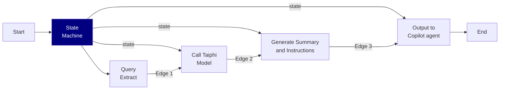

# Welcome to Taiphi Demo

The Chinese Language Teaching Material Engine is an innovative system designed to streamline the process of creating high-quality educational content. This sophisticated tool takes input from teachers and transforms it through a series of steps to produce comprehensive and engaging teaching materials for Chinese language learners.

- **Input Processing**: The engine begins by accepting various inputs from teachers, such as lesson objectives, target vocabulary, and grammar points.
- **Content Generation**: Utilizing advanced natural language processing and AI algorithms, the system generates draft content, including exercises, dialogues, and cultural notes.
- **Agentic AI Enhancement**: As a key highlight, the engine employs Agentic AI to intelligently refine and optimize the generated content, ensuring it meets pedagogical standards and adapts to learner needs.

## Workflow

## LangGraph Documentation
For full documentation visit   [LangGraph Documentation](https://langchain-ai.github.io/langgraph/tutorials/introduction/).
